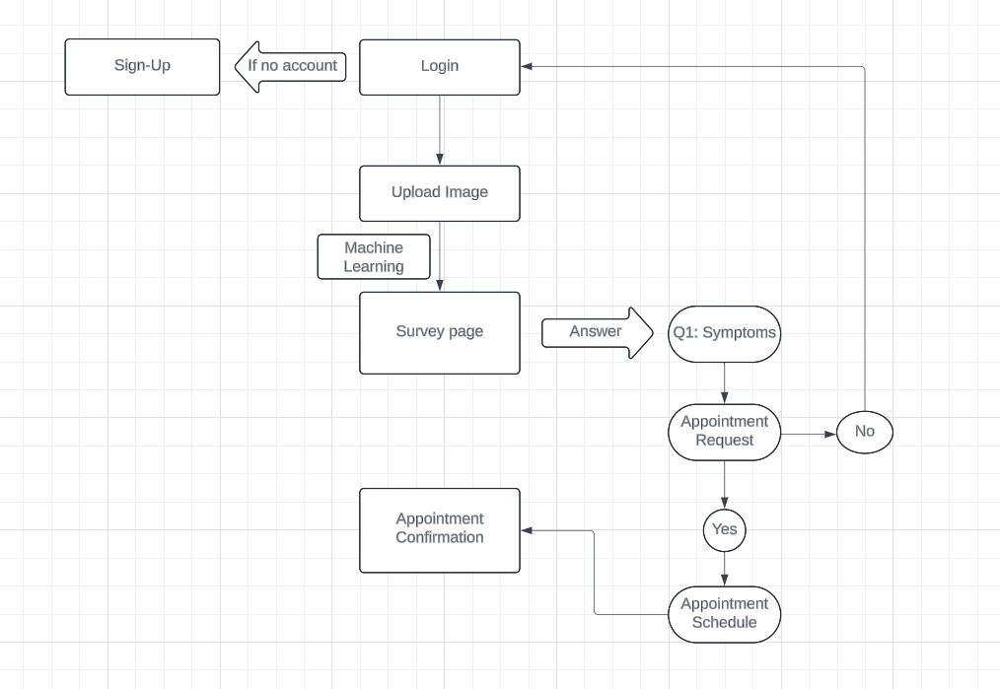
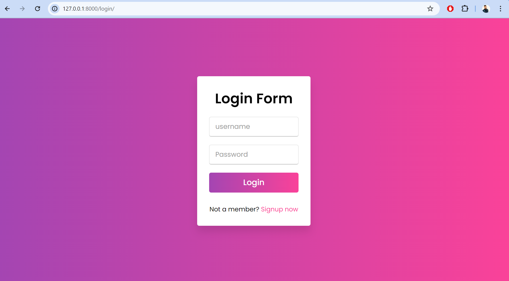

<div>
  
</div>

<h1 align="center">👋 Hi, I'm Kaushikan Dinakaran</h1>

<h3 align="center">🚀 Data Engineer | ML Engineer | MLOps Practitioner</h3>

<p align="center">
🎓 M.S. Data Science (University of North Texas) • 3.9 years industry experience • building cloud-native ETL, real-time pipelines, ML systems, and production dashboards
</p>

<div align="center">
  <a href="https://www.linkedin.com/in/kaushikan-dinakaran-526a47205/" target="_blank">
    
  </a>
  <a href="https://github.com/kaushikandinakaran" target="_blank">
    
  </a>
  <a href="mailto:kaushikandinakaran@gmail.com">
    
  </a>
</div>

---

## 🔎 One-line summary
Data Engineer & ML Engineer experienced in designing reliable ETL/streaming pipelines, data warehouses, and production ML systems. Skilled at converting messy data into scalable data products that drive decisions.

---

## 🔧 Tech Stack & Tools (selected)
<p align="center">
  <!-- Programming & Data -->
  
  
  
  
  

  <!-- Cloud & Warehouses -->
  
  
  
  
  

  <!-- Orchestration & Streaming -->
  
  
  
  
  

  <!-- ML & MLOps -->
  
  
  
  

  <!-- DevOps / Infra -->
  
  
  
  
  

  <!-- BI / Visualization -->
  
  
  

  <!-- Databases & Storage -->
  
  
  
  
  
  

  <!-- Dev Tools -->
  
  
  
</p>

---

## 🌟 Highlights & Impact
- Automated email-to-data ETL pipeline — **reduced manual work by 80%** (≈6 hrs/week).  
- Built Kafka + Airflow streaming system — **reduced analytics latency from 24h → 5 minutes**.  
- Deployed ResNet-based medical imaging classifier — **92% validation accuracy** (prototype).  
- Delivered Power BI dashboards enabling **40% faster executive reporting**.


---

## 📚 Projects 


---

### 1) PathoVision — Chest X-ray Classifier & Triage
- **Objective:** Classify chest X-rays into *COVID-19 / Pneumonia / Normal* and support symptom triage + appointment booking.  
- **Tech:** TensorFlow (ResNet variants), Django, Celery, Docker, PostgreSQL/SQLite  
- **Outcome:** Prototype model + web flow. **Accuracy:** `<92%>` on `4392` images.  
- **Repo:** `https://github.com/kaushikandinakaran/pathovision`
- **Architecture:**
```
User -> Frontend -> Django API -> Celery tasks -> TF model -> DB -> Notification Service (email/SMS)
```
- Assets / Demo:
<p align="center">
  
</p>

<p align="center">
  
</p>

<p align="center">
  
</p>

<p align="center">
  
</p>

<p align="center">
  
</p>

<p align="center">
  
</p>

<p align="center">
  
</p>

---

### 2) MEPS Respiratory Analysis (FAERS / MEPS)
- **Objective:** Exploratory and cohort analysis focused on asthma & influenza indicators.  
- **Tech:** Python, Pandas, Jupyter, SQL, statsmodels  
- **Outcome:** Reproducible notebooks highlighting cohort trends and actionable insights. **Dataset size:** `300k+` rows.  
- **Repo:** `https://github.com/kaushikandinakaran/FAERS-dataset-analysis`  
- **Notes:** Include a data acquisition script for MEPS/FAERS and instructions about PHI / access restrictions.

---

### 3) Real-time ASL → Text & Speech (ASL-Translator)
- **Objective:** Translate live American Sign Language gestures to text and speech for accessibility.  
- **Tech:** MediaPipe, YOLOv11, TensorFlow, LangChain, gTTS, Docker  
- **Outcome:** Demo system with `92%` recognition and near-real-time latency on target hardware.  
- **Repo:** `https://github.com/kaushikandinakaran/ms_asl`  
- **Architecture:**
```
Camera -> MediaPipe (landmarks) -> Tensor Model -> LLM Contextualizer -> TTS -> Speaker / UI
```

---
### 4) News Research Tool — Streamlit + LangChain + FAISS + OpenAI
- **Objective:** Extract news content from URLs and answer user questions using embeddings, vector search, and LLM reasoning.  
- **Tech:** Streamlit, LangChain, FAISS, OpenAI Embeddings & GPT, BeautifulSoup, Python-dotenv  
- **Outcome:** Interactive research tool that retrieves article context and provides source-grounded answers.  
- **Repo:** `https://github.com/kaushikandinakaran/News_Research_Tool`  

#### **Architecture**
```
Streamlit UI → URL Fetcher → Text Extractor → Text Cleaner → Text Splitter → OpenAI Embeddings → FAISS Vector Store → Retriever → LangChain RetrievalQA → Final Answer with Sources
```

---
### 5) Jarvis Smart Voice Assistant & ML APIs
- **Objective:** Modular voice assistant integrating OCR, object detection, and automation workflows.  
- **Tech:** Python, Flask, SpeechRecognition, OpenCV, Tesseract, Docker, Redis  
- **Outcome:** Containerized microservices exposing prediction and automation APIs.  

---


## 🎓 Education & Certifications
- **M.S., Data Science** — University of North Texas — *Dec 2025*  
- **B.Tech, Computer Science & Engineering** — SRM Institute of Science and Technology — *2022*  
- **Certifications:** Learning Data Analytics, Python for Data Science and AI,HackerRank SQL, Google Data Engineer (in progress)

---

## 📄 Resume & Contact
- **Resume (PDF):** `resume/Kaushikan_Dinakaran.pdf` *(add to repo)*  
- **LinkedIn:** https://www.linkedin.com/in/kaushikan-dinakaran-526a47205/  
- **GitHub:** https://github.com/kaushikandinakaran  
- **Email:** kaushikandinakaran@gmail.com


<div>
  
</div>
